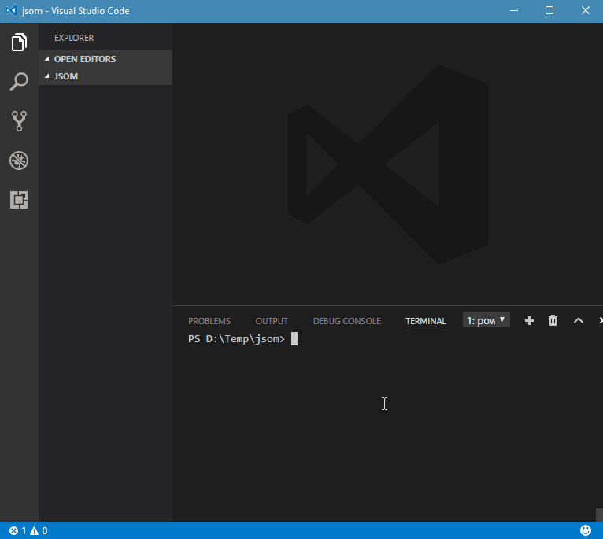
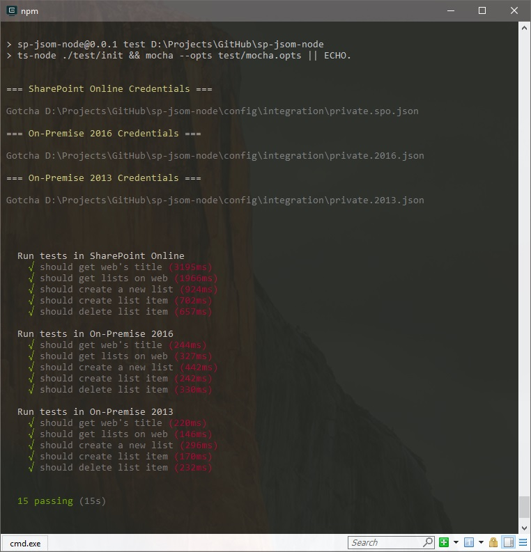

# sp-jsom-node - SharePoint JavaScript Object Model for Node.js

[](https://nodei.co/npm/sp-jsom-node/)

[](https://badge.fury.io/js/sp-jsom-node)
[](https://www.npmjs.com/package/sp-jsom-node)
[](https://gitter.im/sharepoint-node/Lobby)

`sp-jsom-node` provides a feasibility of using JSOM (CSOM, SharePoint Client Object Model) in Node.js.

`sp-jsom-node` patches global variables and request client which let's `JSOM` used to behave as if it were in it's usual environment - a browser's SharePoint page.

## Supported SharePoint versions:

- SharePoint Online
- SharePoint 2013
- SharePoint 2016

## Supported authentication scenarios

- SharePoint On-Premise (2013, 2016):
  - User credentials (NTLM)
  - Form-based authentication (FBA)
  - Add-In Only permissions
  - ADFS user credentials

- SharePoint Online:
  - User credentials (SAML)
  - Add-In Only permissions
  - ADFS user credentials

## Get started

### NPM

```bash
npm install sp-jsom-node --save
```

### Yarn

```bash
yarn add sp-jsom-node
```

## Usage examples



### Minimal setup (TypeScript)

```javascript
import { JsomNode } from 'sp-jsom-node';

(new JsomNode()).wizard().then((settings) => {

    /// ... <<< JSOM can be used here

    let ctx = SP.ClientContext.get_current();
    // let ctx = SP.ClientContext(webRelativeUrl);
    ...

}).catch(console.log);

/// ... <<< JSOM can be used here if config file is already on disk
```

First wizard run propmts for SharePoint site url and credentials strategy parameters.

### Minimal setup (JavaScript)

```javascript
const JsomNode = require('sp-jsom-node').JsomNode;

(new JsomNode()).wizard().then((settings) => {

    /// ... <<< JSOM can be used here

    let ctx = SP.ClientContext.get_current();
    ...

}).catch(console.log);
```

### Initiation with parameters

```javascript
import { JsomNode, IJsomNodeSettings } from 'sp-jsom-node';

let settings: any = require('./config/private.json');
let jsomNodeOptions: IJsomNodeSettings = {
    siteUrl: settings.siteUrl,
    authOptions: {
        ...(settings as any)
    }
};

(new JsomNode(jsomNodeOptions)).init();

/// ... <<< JSOM can be used here

const ctx = SP.ClientContext.get_current();
const oWeb = ctx.get_web();
const oLists = oWeb.get_lists();

const listCreationInfo = new SP.ListCreationInformation();
listCreationInfo.set_title('New Lists');
listCreationInfo.set_templateType(100);
const oList = oLists.add(listCreationInfo);

ctx.load(oList);
ctx.executeQueryAsync(() => {
    console.log(oList);
}, (sender, args) => {
    console.log(args.get_message());
});

```

### Modules

By default, only core modules are loaded.
Additional CSOM features can be requested in `modules` setting.

```javascript
import { JsomNode, IJsomNodeSettings } from 'sp-jsom-node';

let settings: any = require('./config/private.json');
let jsomNodeOptions: IJsomNodeSettings = {
    modules: [ 'core', 'taxonomy', 'userprofiles', 'publishing', 'policy' ]
};

(new JsomNode(jsomNodeOptions)).init();

/// ... <<< JSOM can be used here
...
```

#### JSOM Node Settings options

- siteUrl?: string; // Optional SPWeb url
- authOptions?: IAuthOptions; `node-sp-auth` [credentials options](https://github.com/s-KaiNet/node-sp-auth)
- config?: IAuthConf; `node-sp-auth-config` [options](https://github.com/koltyakov/node-sp-auth-config)
  - configPath?: string; // Path to auth config .json | Default is './config/private.json'
  - encryptPassword?: boolean; // Encrypts password to a machine-bind hash | Default is 'true'
  - saveConfigOnDisk?: boolean; // Saves config .json to disk | Default is 'true'
- modules?: string[]; // On demand modules load, [ 'core', 'taxonomy', 'userprofiles', 'publishing', 'policy' ]
- envCode?: 'spo' | '16' | '15'; // Loads different version of JSOM javascripts

Settings can be left blank. Auth options in such a case will be asked by `node-sp-auth-config` [options](https://github.com/koltyakov/node-sp-auth-config) in a wizard like approach.

### Settings scenarios

- No initial settings (defaults): wizard approach, covers console applications cases with user interaction
- With explicitly defined `authOptions`:
  - external tools is in charge for preparing auth credentials in `node-sp-auth` format
  - credentials should not be dumped on disc
- Config file with prepopulated credentials: schedule, job automation, continues integration

## Integration tests

```bash
npm run test
```



## Inspiration and references

This project was mostly inspired by [Vadim Gremyachev](https://github.com/vgrem)'s project - [CSOMNode](https://github.com/vgrem/CSOMNode), but implements JSOM in node in a bit different way, in TypeScript and supports different auth scenarious implemented in [node-sp-auth](https://github.com/s-KaiNet/node-sp-auth) by [Sergei Sergeev](https://github.com/s-KaiNet).
